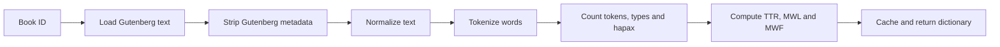
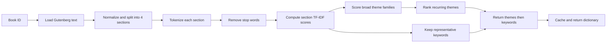
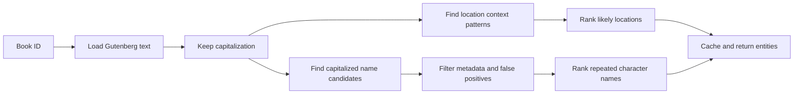
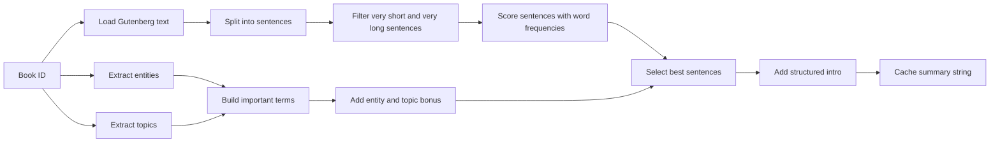
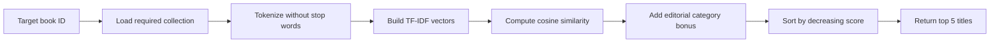
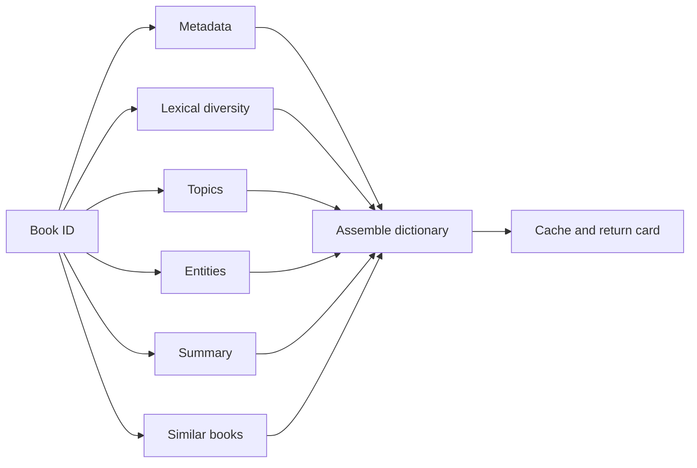

# Bookworm

Bookworm is a lightweight NLP prototype for Project Gutenberg books. It turns
raw literary texts into structured "book cards" with lexical metrics, topics,
entities, summaries and recommendations.

The required CLI entry point is:

```bash
python3 bookworm.py --lexdiv 11
python3 bookworm.py --topics 11
python3 bookworm.py --entities 11
python3 bookworm.py --summarize 11
python3 bookworm.py --similar 11
python3 bookworm.py --card 11
```

## Architecture

```text
bookworm.py
nlp/
  lexical_diversity.py
  topics.py
  entities.py
  summarization.py
  similarity.py
  card.py
services/
  gutenberg.py
  cache.py
utils/
  text_processing.py
data/
  books/
  cache/
diagrams/
requirements.txt
```

`bookworm.py` is the CLI orchestrator. It reads the user command and calls the
right NLP function.

`nlp/` contains the text analysis features required by the subject.

`services/` contains reusable project services: Project Gutenberg access and
cache management.

`utils/` contains low-level text processing helpers: Gutenberg cleanup,
normalization, tokenization, stop-word removal, sentence splitting and section
splitting.

`data/books/` stores downloaded `.txt` books. `data/cache/` stores cached
results. Generated data files are ignored by Git.

## Methods

### Lexical diversity

The program tokenizes the text and computes:

- `tok`: total word tokens
- `typ`: unique word tokens
- `hap`: words occurring once
- `ttr`: type-token ratio
- `mwl`: mean word length
- `mwf`: mean word frequency

### Topics

The book is split into four sections. For each section, the program removes
stop words and computes TF-IDF scores. Important keywords are then mapped to
broader theme families such as animals, authority, adventure, fantasy,
mirror world or mystery.

The returned list starts with the most present broad themes and is completed
with representative keywords. This follows the idea that topics should describe
general themes, not only raw frequent words. It is fast and explainable, but it
depends on the quality of the handcrafted theme vocabulary.

### Entities

The prototype uses capitalization and context heuristics to find likely
characters and locations. It is lightweight and easy to explain, but less
accurate than a trained NER model.

### Summarization

The summary uses a lightweight hybrid method. First, the program extracts
characters, locations and broad topics. These structured signals are used to
build a short introductory sentence and to give a bonus to important sentences.
Then the program applies extractive summarization: sentences are scored with
word frequencies and returned in original order.

This follows the teacher's guidance: the summary is not only a list of frequent
sentences, it is guided by information extracted from the text. The limitation
is that the template sentence can be less natural for some books, so the method
keeps extractive sentences as a robust fallback.

### Similarity

The program vectorizes the required book collection with TF-IDF and compares
books using cosine similarity. A small editorial category bonus is added so
books from the same audience/genre group are ranked more naturally. It returns
the five closest titles.

## Cache

Some operations can be expensive, so results are cached in `data/cache/`.

For example:

```text
data/cache/topics_11.json
data/cache/summary_11.json
data/cache/similar_11.json
```

Use `--no-cache` to force recomputation:

```bash
python3 bookworm.py --topics 11 --no-cache
```

## Diagrams

Pipeline diagrams are included below for quick review. The same diagrams are
also available as separate files in `diagrams/`.

### Lexical Diversity Pipeline



### Topics Pipeline



### Entities Pipeline



### Summarization Pipeline



### Similarity Pipeline



### Book Card Pipeline



## Notes For Presentation

The project avoids large transformers, LLMs and APIs. The goal is not perfect
NLP quality, but a clear, reproducible and defensible methodology.
