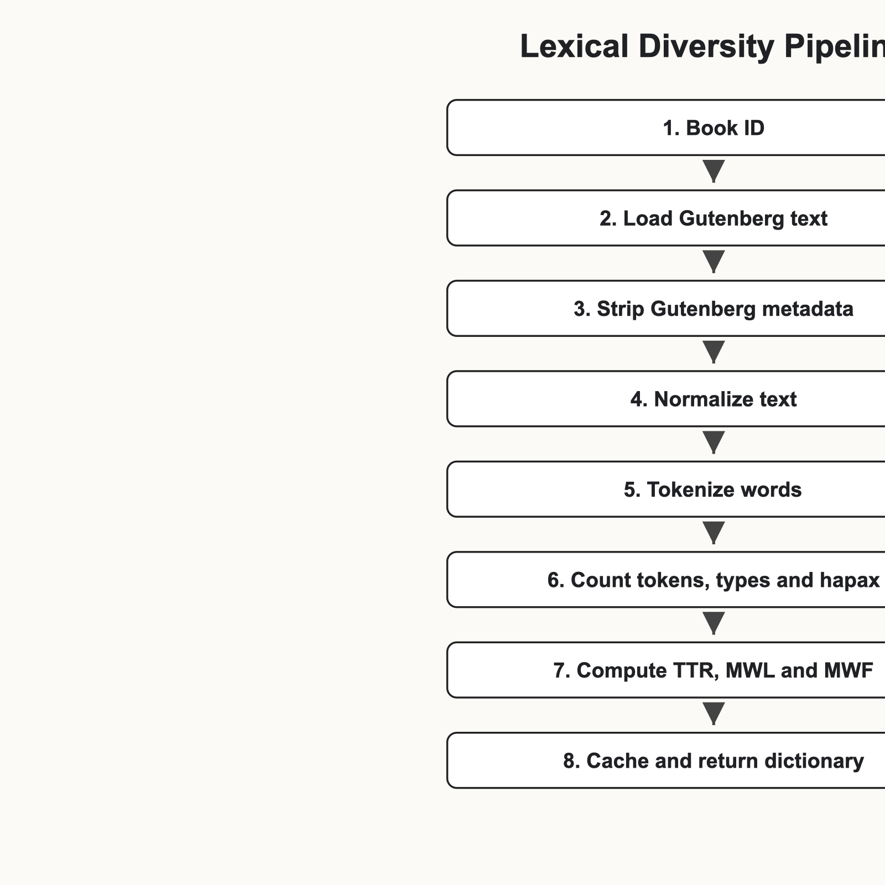
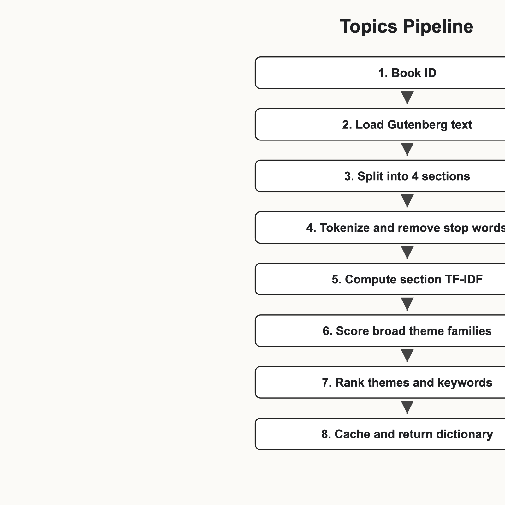
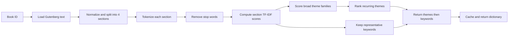
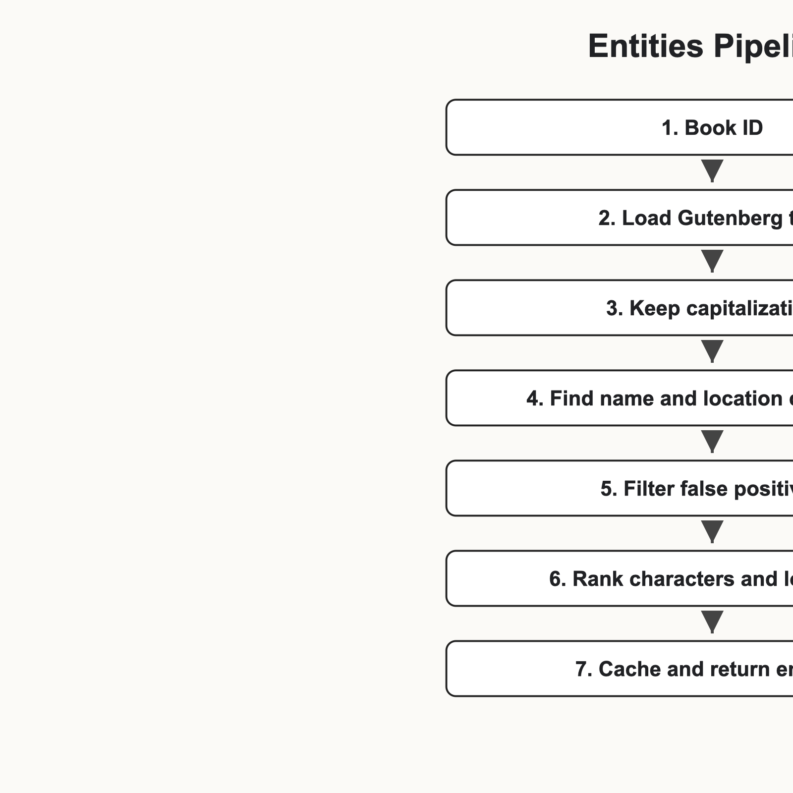
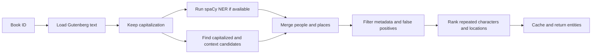
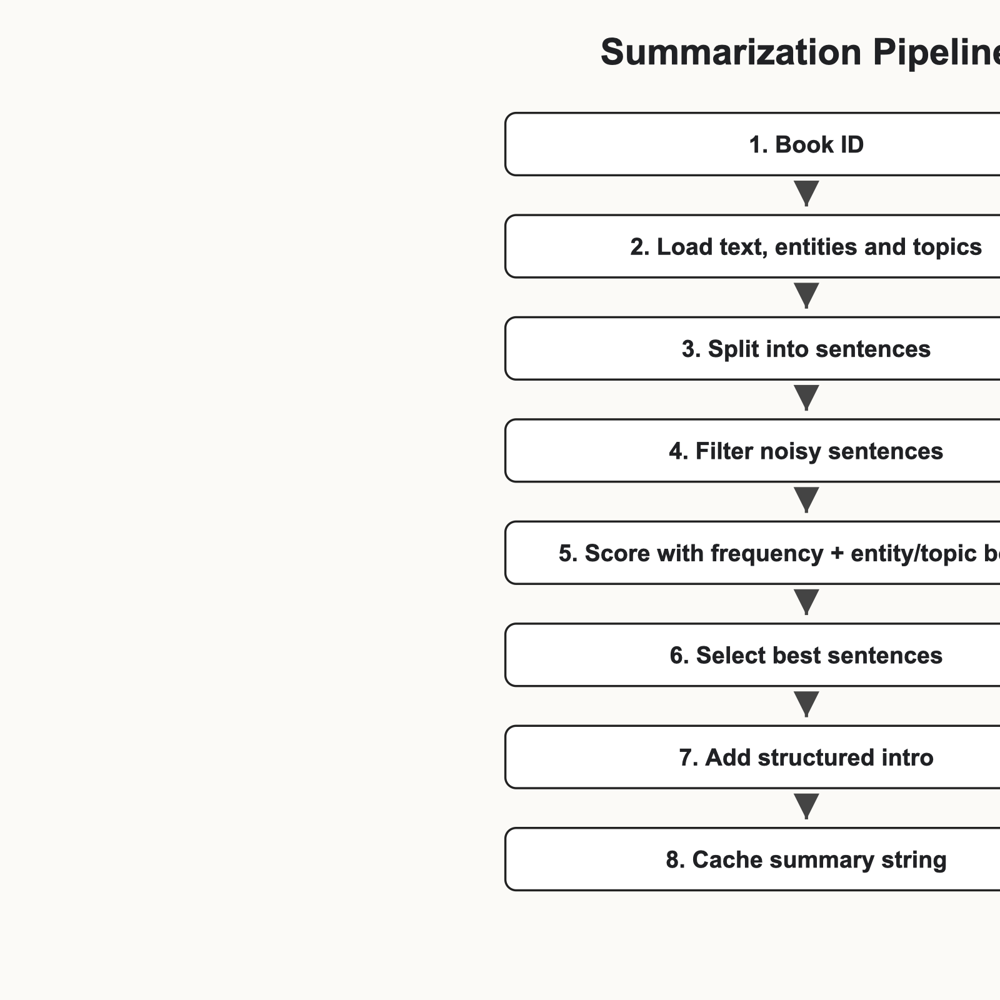
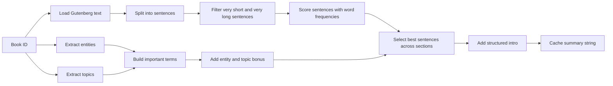
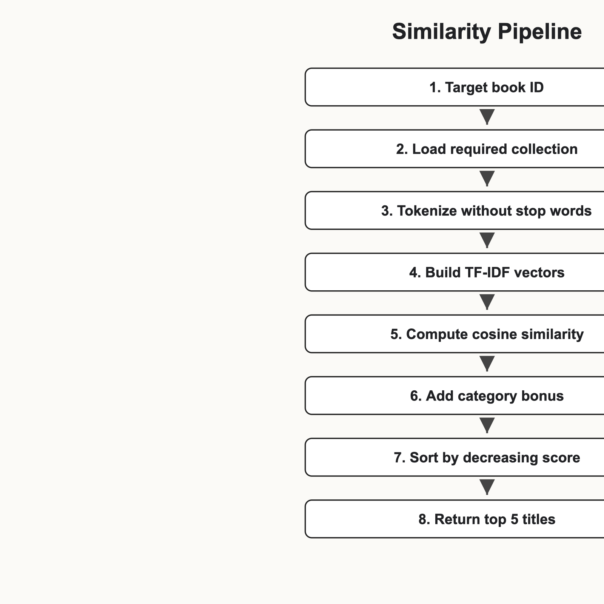
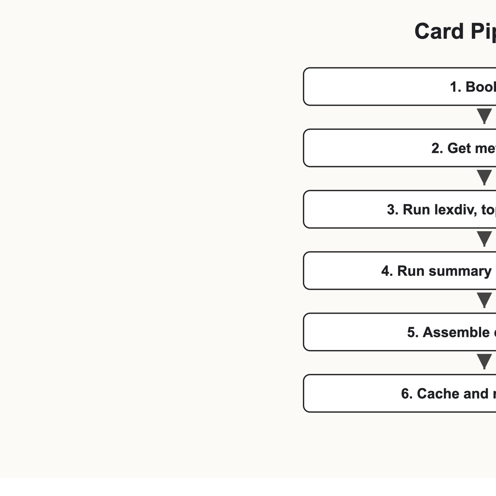
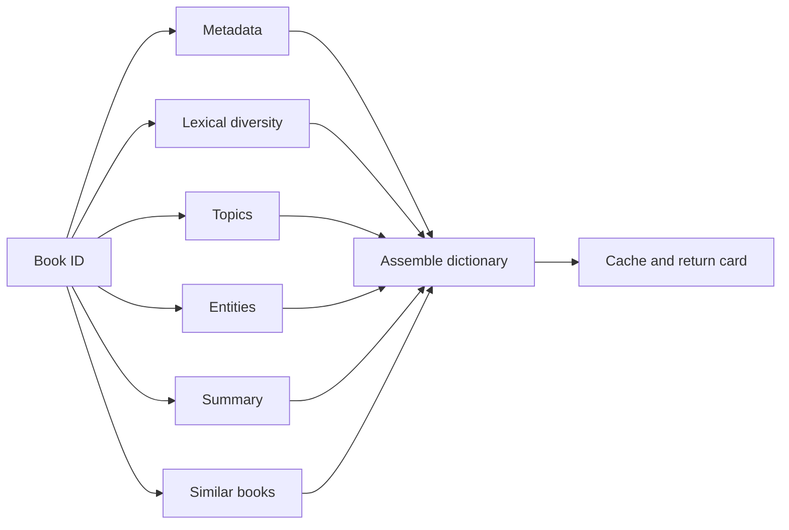

# Bookworm

Bookworm is a lightweight NLP prototype for Project Gutenberg books. It turns
raw literary texts into structured "book cards" with lexical metrics, topics,
entities, summaries and recommendations.

The required CLI entry point is:

```bash
python3 bookworm.py --lexdiv 11
python3 bookworm.py --topics 11
python3 bookworm.py --entities 11
python3 bookworm.py --summarize 11
python3 bookworm.py --similar 11
python3 bookworm.py --card 11
```

## Installation

The project uses `spaCy` for stronger named-entity recognition and keeps a
custom-rule fallback if the model is not installed.

```bash
python3 -m pip install -r requirements.txt
python3 -m spacy download en_core_web_sm
```

## Architecture

```text
bookworm.py
modules/
  lexdiv.py
  topics.py
  entities.py
  summarize.py
  similar.py
  card.py
services/
  gutenberg.py
  cache.py
utils/
  text_processing.py
data/
  books/
  cache/
requirements.txt
```

`bookworm.py` is the CLI orchestrator. It reads the user command and calls the
right NLP function.

`modules/` contains the text analysis features required by the subject.

`services/` contains reusable project services: Project Gutenberg access and
cache management.

`utils/` contains low-level text processing helpers: Gutenberg cleanup,
normalization, tokenization, stop-word removal, sentence splitting and section
splitting.

`data/books/` stores downloaded `.txt` books. `data/cache/` stores cached
results. Generated data files are ignored by Git.

## Methodology Choices

The project favors lightweight and explainable NLP methods over heavy models.
This keeps the CLI fast enough for a live demo and makes each result easier to
justify during the presentation.

| Task | Chosen approach | Alternatives considered | Trade-off |
| --- | --- | --- | --- |
| Lexical diversity | Direct token statistics | More advanced indices such as MTLD or Yule's K | Simple and reproducible, but less rich than bonus metrics |
| Topics | TF-IDF per section + literary theme dictionary | LDA or LSA topic modeling | Explainable and fast, but depends on handcrafted vocabulary |
| Entities | spaCy NER + custom literary filters | Regex-only NER | Better recognition than regex, still lightweight, but requires a small model |
| Summary | Structured intro + extractive sentence scoring | TextRank, clustering, abstractive generation | No heavy model and easy to explain, but less natural than human summaries |
| Similarity | TF-IDF cosine similarity + small metadata bonuses | Pure cosine similarity, clustering | Better recommendations for the fixed collection, but still collection-dependent |

## Methods

### Lexical diversity

The program tokenizes the text and computes:

- `tok`: total word tokens
- `typ`: unique word tokens
- `hap`: words occurring once
- `ttr`: type-token ratio
- `mwl`: mean word length
- `mwf`: mean word frequency

### Topics

The book is split into four balanced sections. If chapter headings are found,
chapters are grouped across the whole book instead of only using the beginning.
For each section, the program removes stop words and computes TF-IDF scores.
Important keywords are then mapped to broader theme families such as animals,
authority, adventure, fantasy, mirror world or mystery.

The returned list starts with the most present broad themes and is completed
with representative keywords. This follows the idea that topics should describe
general themes, not only raw frequent words. It is fast and explainable, but it
depends on the quality of the handcrafted theme vocabulary.

### Entities

The prototype combines `spaCy` named-entity recognition with custom literary
rules. `spaCy` detects people and places, then the project adds capitalization,
context and repetition rules to clean the output for book texts. If the model
is unavailable, the program falls back to the custom rules so the CLI still
runs.

Locations must appear repeatedly or match strong place patterns, which avoids
overvaluing cities or countries that are only mentioned in passing.

### Summarization

The summary uses a lightweight hybrid method. First, the program extracts
characters, locations and broad topics. These structured signals are used to
build a short introductory sentence and to give a bonus to important sentences.
Then the program applies extractive summarization: sentences are scored with
word frequencies, entity and topic bonuses, then selected from different parts
of the book and returned in original order.

This follows the teacher's guidance: the summary is not only a list of frequent
sentences, it is guided by information extracted from the text. The limitation
is that extractive sentences can still sound less natural than a human-written
summary, so the method keeps the rules simple and reproducible.

### Similarity

The program vectorizes the required book collection with TF-IDF and compares
books using cosine similarity. Small editorial category and author bonuses are
added only as secondary signals so the textual TF-IDF comparison remains the
main ranking factor. It returns the five closest titles, sorted by decreasing
similarity.

## Cache

Some operations can be expensive, so results are cached in `data/cache/`.

For example:

```text
data/cache/topics_v4_11.json
data/cache/summary_v4_11.json
data/cache/similar_v6_11.json
```

Use `--no-cache` to force recomputation:

```bash
python3 bookworm.py --topics 11 --no-cache
```

## Diagrams

The subject asks for a separate pipeline diagram for each NLP task. They are
included directly in this Markdown documentation and exported as PNG files in
`diagrams/`.

### Lexical Diversity Pipeline




### Topics Pipeline





### Entities Pipeline





### Summarization Pipeline





### Similarity Pipeline




### Book Card Pipeline





## Notes For Presentation

The project avoids large transformers, LLMs and APIs. The goal is not perfect
NLP quality, but a clear, reproducible and defensible methodology.

Main limitations to mention during the presentation:

- Entity extraction is strongest when the `en_core_web_sm` model is installed.
- Topic labels depend on a handcrafted theme vocabulary.
- Summaries are extractive, so they reuse sentences from the source text.
- Similarity is computed on a fixed comparison collection.
