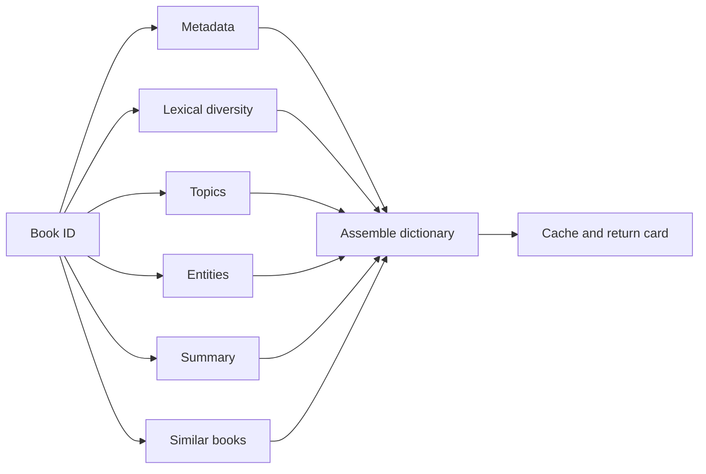

# Book card pipeline

```mermaid
flowchart LR
    A[Book ID] --> B[Metadata]
    A --> C[Lexical diversity]
    A --> D[Topics]
    A --> E[Entities]
    A --> F[Summary]
    A --> G[Similar books]
    B --> H[Assemble dictionary]
    C --> H
    D --> H
    E --> H
    F --> H
    G --> H
    H --> I[Cache and return card]
```
