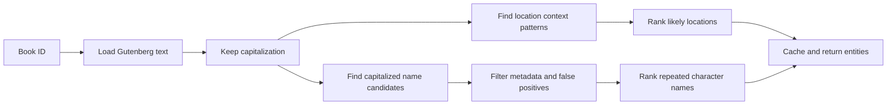

# Entities pipeline

```mermaid
flowchart LR
    A[Book ID] --> B[Load Gutenberg text]
    B --> C[Keep capitalization]
    C --> D[Find capitalized name candidates]
    C --> E[Find location context patterns]
    D --> F[Filter metadata and false positives]
    E --> G[Rank likely locations]
    F --> H[Rank repeated character names]
    G --> I[Cache and return entities]
    H --> I
```
