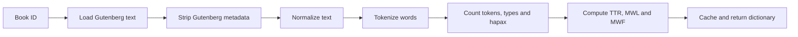

python3 bookworm.py --entities 11# Lexical diversity pipeline

```mermaid
flowchart LR
    A[Book ID] --> B[Load Gutenberg text]
    B --> C[Strip Gutenberg metadata]
    C --> D[Normalize text]
    D --> E[Tokenize words]
    E --> F[Count tokens, types and hapax]
    F --> G[Compute TTR, MWL and MWF]
    G --> H[Cache and return dictionary]
```
