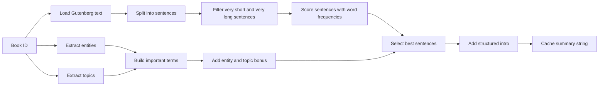

# Summarization pipeline

```mermaid
flowchart LR
    A[Book ID] --> B[Load Gutenberg text]
    A --> C[Extract entities]
    A --> D[Extract topics]
    B --> E[Split into sentences]
    E --> F[Filter very short and very long sentences]
    C --> G[Build important terms]
    D --> G
    F --> H[Score sentences with word frequencies]
    G --> I[Add entity and topic bonus]
    H --> J[Select best sentences]
    I --> J
    J --> K[Add structured intro]
    K --> L[Cache summary string]
```
