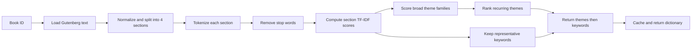

# Topics pipeline

```mermaid
flowchart LR
    A[Book ID] --> B[Load Gutenberg text]
    B --> C[Normalize and split into 4 sections]
    C --> D[Tokenize each section]
    D --> E[Remove stop words]
    E --> F[Compute section TF-IDF scores]
    F --> G[Score broad theme families]
    G --> H[Rank recurring themes]
    F --> I[Keep representative keywords]
    H --> J[Return themes then keywords]
    I --> J
    J --> K[Cache and return dictionary]
```
