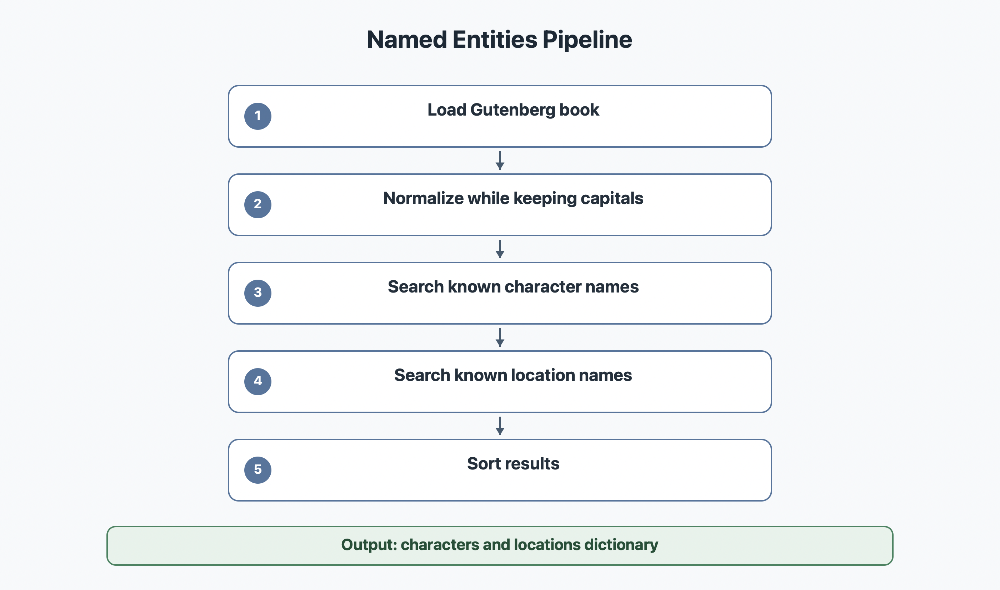

# Entities

La commande `--entities` extrait les personnages et les lieux d'un livre.

Le code principal est dans `modules/entities.py`.

## Diagramme



## Objectif

Le but est de retourner un dictionnaire avec deux listes :

```python
{
    "characters": [...],
    "locations": [...]
}
```

Pour Alice, on cherche par exemple `Alice`, `White Rabbit`, `Cheshire Cat`, `Queen`, `Wonderland`, `Garden`, etc.

## Methode choisie

Nous utilisons une reconnaissance par listes connues.

Le module contient :

- `KNOWN_CHARACTERS` pour les personnages ;
- `KNOWN_LOCATIONS` pour les lieux.

Le texte est nettoye avec `normalize_text(text, lowercase=False)` pour garder les majuscules et rendre la recherche plus propre.

Ensuite, le module cherche si chaque entite connue apparait dans le texte.

## Pourquoi cette methode

Une vraie reconnaissance d'entites nommees avec un modele NLP serait plus avancee, mais le sujet demande une solution portable et comprehensible.

Cette methode est adaptee a Alice car les personnages et lieux importants sont connus et facilement verifiables.

Elle est aussi facile a expliquer a l'oral : le programme compare le texte avec une liste d'entites attendues.

## Limites

Cette methode ne decouvre pas automatiquement un nouveau personnage inconnu. Si on veut l'utiliser sur beaucoup d'autres livres, il faudra enrichir les listes ou ajouter une detection automatique des noms propres.

## Commande CLI

```bash
python3 bookworm.py --entities 11
```

## Trophees valides

- entites
- entities_doc
