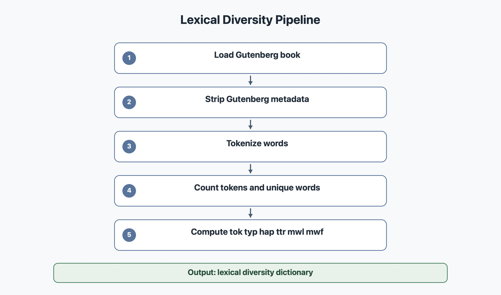

# Lexical Diversity

La commande `--lexdiv` calcule la diversite lexicale d'un livre.

Le code principal est dans `modules/lexdiv.py`.

## Diagramme



## Objectif

La diversite lexicale sert a mesurer si un texte utilise beaucoup de mots differents ou s'il repete souvent les memes mots.

Un texte avec beaucoup de vocabulaire different aura une diversite plus forte. Un texte qui repete toujours les memes mots aura une diversite plus faible.

## Methode

Le module commence par tokeniser le texte avec `tokenize(text)`.

Ensuite, il calcule plusieurs mesures :

- `tok` : nombre total de mots ;
- `typ` : nombre de mots differents ;
- `hap` : nombre de mots qui apparaissent une seule fois ;
- `ttr` : rapport entre mots differents et mots totaux ;
- `mwl` : longueur moyenne des mots ;
- `mwf` : frequence moyenne des mots.

## Exemple simple

Avec cette liste :

```python
["alice", "rabbit", "alice", "door"]
```

On obtient :

```text
tok = 4
```

car il y a 4 mots au total.

```text
typ = 3
```

car les mots differents sont `alice`, `rabbit`, `door`.

```text
hap = 2
```

car `rabbit` et `door` apparaissent une seule fois.

## Pourquoi cette methode

Cette methode est simple, rapide et conforme au sujet, car elle retourne un dictionnaire avec au moins 5 mesures de diversite lexicale.

Elle ne depend pas d'un modele externe lourd, donc elle reste portable sur l'ordinateur des evaluateurs.

## Commande CLI

```bash
python3 bookworm.py --lexdiv 11
```

## Trophee valide

- lexdiv
