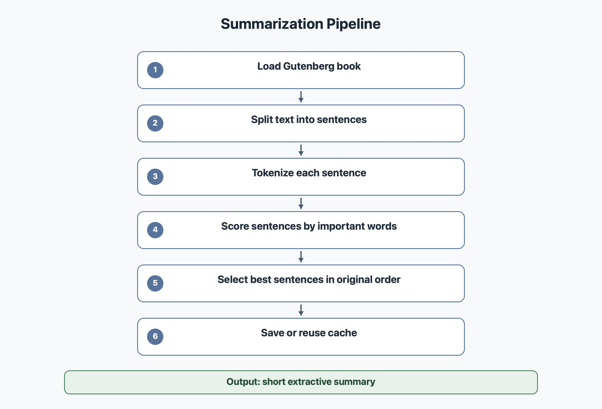

# Summarize

La commande `--summarize` resume un livre en quelques phrases.

Le code principal est dans `modules/summarize.py`.

## Diagramme



## Objectif

Le but est de produire un resume extractif. Cela veut dire que le programme ne cree pas de nouvelles phrases : il selectionne des phrases existantes du livre.

## Methode choisie

Nous utilisons une methode extractive par sections et frequence de mots.

L'idee est simple : le livre est d'abord separe en grandes sections, puis le programme choisit des phrases importantes dans chaque partie. Cela donne un resume plus representatif du livre entier qu'une selection globale de quelques phrases.

## Etapes

1. Le livre est nettoye pour retirer l'en-tete et le footer Gutenberg.
2. La table des matieres est ignoree pour ne garder que les vrais chapitres.
3. Les chapitres sont regroupes en grandes sections.
4. Chaque section est decoupee en phrases avec `split_into_sentences`.
5. Les phrases trop courtes, trop longues, trop repetees ou trop dialoguees sont filtrees.
6. Chaque phrase est tokenisee et les mots vides sont retires.
7. Le programme calcule les mots les plus frequents dans chaque section.
8. Les phrases recoivent un score selon les mots importants qu'elles contiennent.
9. Les meilleures phrases de chaque section sont selectionnees.
10. Les phrases choisies sont remises dans l'ordre original.
11. Le resultat est sauvegarde dans `data/cache`.

## Pourquoi remettre les phrases dans l'ordre

Le score sert a trouver les phrases importantes, mais le resume doit rester lisible. Une fois les phrases choisies, on les remet dans l'ordre du livre pour garder une progression logique.

## Pourquoi cette methode

Elle est simple, rapide, portable et ne depend pas d'un modele externe lourd.

Elle est moins intelligente qu'un modele generatif, mais elle respecte bien le cadre du projet : resumer un livre en quelques phrases avec une methode explicable.

## Cache

Le resultat est sauvegarde avec une cle du type :

```text
summary_v8_11_sentences8.json
```

## Commande CLI

```bash
python3 bookworm.py --summarize 11
```

## Trophees valides

- resume
- summarize_doc
