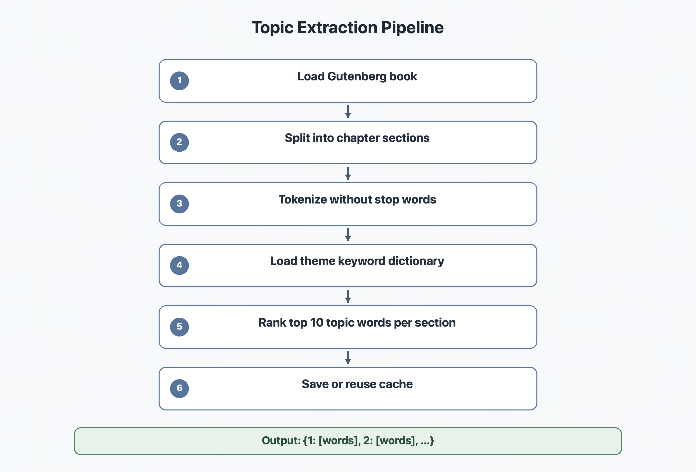

# Topics

La commande `--topics` extrait les mots principaux de plusieurs sections du livre.

Le code principal est dans `modules/topics.py`.

## Diagramme



## Objectif

Le but est d'obtenir les sujets principaux de chaque partie du livre. Pour Alice, cela permet par exemple de voir revenir des mots comme `rabbit`, `door`, `queen`, `garden` ou `tea` selon les chapitres.

## Methode choisie

Nous utilisons une methode par dictionnaire de themes.

Le fichier `data/topic_keywords.json` contient des themes litteraires et des mots associes. Le module compare les mots du livre avec ce dictionnaire pour faire ressortir les mots importants.

Cette methode remplace des modeles plus lourds comme LDA ou LSA.

## Etapes

1. Le livre est charge avec `load_book`.
2. Le texte est nettoye et decoupe en sections.
3. Chaque section est tokenisee.
4. Les mots vides sont retires.
5. Les mots sont compares au dictionnaire de themes.
6. Le module garde les meilleurs mots pour chaque section.
7. Le resultat est sauvegarde dans `data/cache`.

## Pourquoi ne pas utiliser LDA ou LSA

LDA et LSA sont des methodes de topic modeling plus mathematiques.

Elles peuvent etre interessantes, mais elles sont plus difficiles a expliquer, plus instables sur un petit corpus et parfois moins precises pour un projet ou les themes attendus sont litteraires.

La methode par dictionnaire est plus transparente : on peut montrer directement pourquoi un mot est considere comme important.

## Cache

Le resultat de `--topics` est sauvegarde dans `data/cache` avec une cle du type :

```text
topics_11_top10_sections4.json
```

Avant de recalculer, le programme verifie si ce fichier existe deja. Cela evite de refaire le meme calcul plusieurs fois.

## Commande CLI

```bash
python3 bookworm.py --topics 11
```

## Trophees valides

- sujets
- topics-doc
